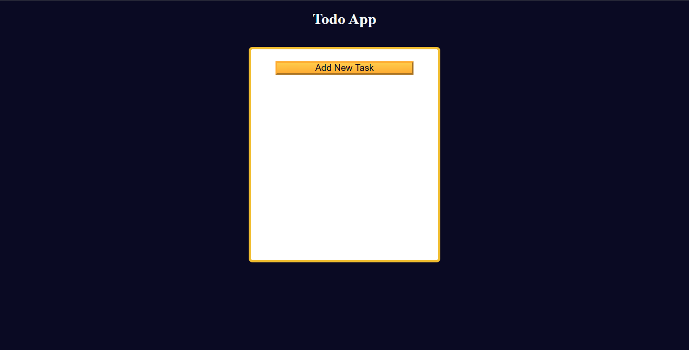

# Todo App (localStorage)

A fully functional Todo application built with **HTML, CSS, and vanilla JavaScript**.

This project demonstrates client-side state management, persistent storage using `localStorage`, form handling, and dynamic UI rendering — all without frameworks.

---

## Live Demo
🔗 https://sharpsanders.github.io/todo-app-localStorage/



---

## Overview

This Todo app allows users to:

- Add tasks with optional date and description
- Edit existing tasks
- Delete tasks
- Persist data across page reloads
- Prevent accidental loss of unsaved form changes

All logic runs client-side and updates the UI dynamically.

---

## Tech Stack

- **HTML5** – semantic structure, form, dialog modal
- **CSS3** – responsive layout, card UI, modal styling
- **JavaScript (ES6+)** – state management, DOM manipulation, localStorage

No frameworks. No backend.

---

## Key Features

### Add / Update Tasks
- Single form handles both creation and updates
- Title validation required
- Unique task IDs generated using sanitized title + timestamp
- New tasks appear at the top of the list

### Edit Tasks
- Clicking **Edit** loads task data into the form
- Button label switches dynamically (Add → Update)
- Preserves existing data for modification

### Delete Tasks
- Removes task from UI
- Removes task from `localStorage`
- Updates state immediately

### Local Persistence
- Tasks stored under `"data"` key in `localStorage`
- Automatically rehydrates state on page load

### Unsaved Changes Protection
- Uses the native `<dialog>` element
- Detects modified form inputs
- Prompts user to Cancel or Discard before closing

### Input Sanitization
- Removes special characters from titles/descriptions
- Ensures clean IDs and display formatting

---

## What This Project Demonstrates

- Managing application state with plain JavaScript
- Using `localStorage` for persistent client-side data
- Handling dynamic DOM rendering
- Implementing update vs create logic in a single workflow
- Working with modal dialogs for user confirmation flows
- Defensive input handling and validation

---

## Code Structure

todo-app-localStorage/
├── index.html
├── styles.css
└── script.js


Core state is stored in:

```js
const taskData = JSON.parse(localStorage.getItem("data")) || [];
let currentTask = {};
Rendering is handled through a centralized updateTaskContainer() function that rebuilds the UI from state.

How To Run Locally
Clone the repository:

git clone https://github.com/SharpSanders/todo-app-localStorage.git
Open index.html in your browser

No build process required.

Future Improvements
Task completion toggle

Filtering (All / Active / Completed)

Search functionality

Drag-and-drop reordering

Refactor into modular architecture

Author
Created by Trevyn Sanders
Frontend Developer | Better Endeavors LLC